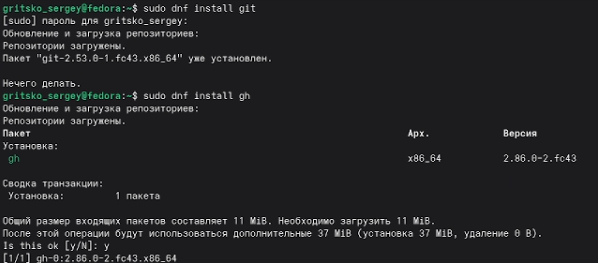
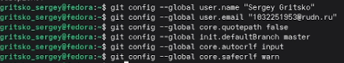
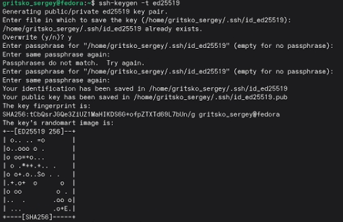
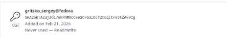
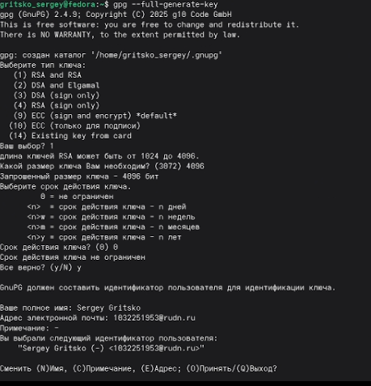
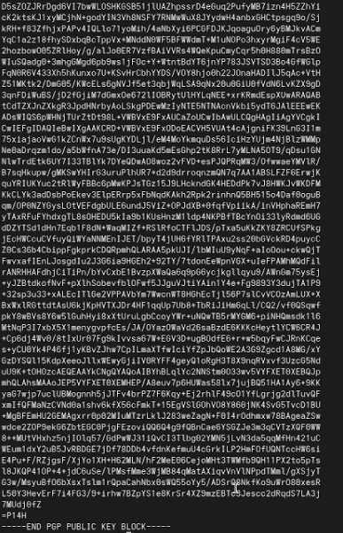
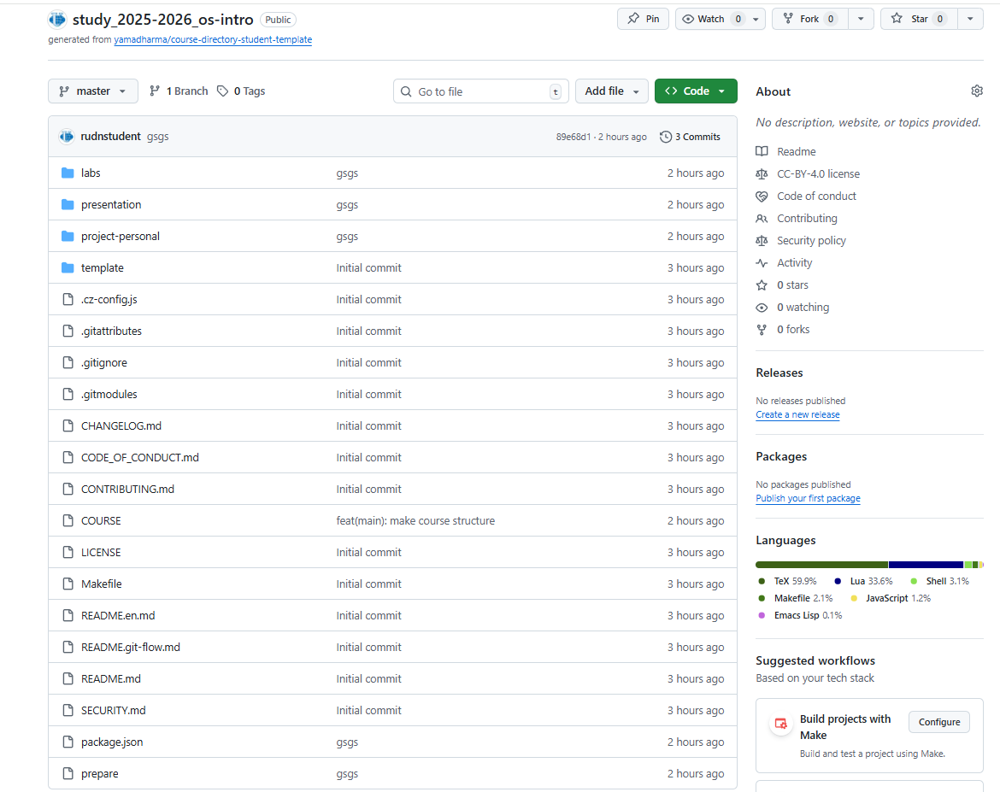

---
## Front matter
title: "Лабораторная работа №2"
subtitle: "дисциплина: Архитектура компьютера"
author: "Грицко Сергей"

## Generic otions
lang: ru-RU\
toc-title: "Содержание"

## Bibliography
bibliography: bib/cite.bib
csl: pandoc/csl/gost-r-7-0-5-2008-numeric.csl

## Pdf output format
toc: true # Table of contents
toc-depth: 2
lof: true # List of figures
lot: true # List of tables
fontsize: 12pt
linestretch: 1.5
papersize: a4
documentclass: scrreprt
## I18n polyglossia
polyglossia-lang:
  name: russian
  options:
    - spelling=modern
    - babelshorthands=true
polyglossia-otherlangs:
  name: english
## I18n babel
babel-lang: russian
babel-otherlangs: english
## Fonts
mainfont: IBM Plex Serif
romanfont: IBM Plex Serif
sansfont: IBM Plex Sans
monofont: IBM Plex Mono
mathfont: STIX Two Math
mainfontoptions: Ligatures=Common,Ligatures=TeX,Scale=0.94
romanfontoptions: Ligatures=Common,Ligatures=TeX,Scale=0.94
sansfontoptions: Ligatures=Common,Ligatures=TeX,Scale=MatchLowercase,Scale=0.94
monofontoptions: Scale=MatchLowercase,Scale=0.94,FakeStretch=0.9
mathfontoptions:
## Biblatex
biblatex: true
biblio-style: "gost-numeric"
biblatexoptions:
  - parentracker=true
  - backend=biber
  - hyperref=auto
  - language=auto
  - autolang=other*
  - citestyle=gost-numeric
## Pandoc-crossref LaTeX customization
figureTitle: "Рис."
tableTitle: "Таблица"
listingTitle: "Листинг"
lofTitle: "Список иллюстраций"
lotTitle: "Список таблиц"
lolTitle: "Листинги"
## Misc options
indent: true
header-includes:
  - \usepackage{indentfirst}
  - \usepackage{float} # keep figures where there are in the text
  - \floatplacement{figure}{H} # keep figures where there are in the text
---

# Цель работы

Цель данной работы заключается в изучение идеологии и применения средств контроля версий и освоение умения работы с git.

# Задание

1. базовую конфигурацию для работы с git.

2. ключ SSH.

3. ключ PGP.

4. подписки git.

5. на GitHub.

6. локальный каталог для выполнений по предмету.

# Теоритическое введение

Системы контроля версий (**Version Control System, VCS***) применяются при работе нескольких человек над одним проектом. Обычно основное дерево проекта хранится в локальном или удалённом репозитории, к которому настроен доступ для участников проекта. При внесении изменений в содержание проекта система контроля версий позволяет их фиксировать, совмещать изменения, произведённые разными участниками проекта, производить откат к любой более ранней версии проекта, если это требуется.

В классических системах контроля версий используется централизованная модель, предполагающая наличие единого репозитория для хранения файлов. Выполнение большинства функций по управлению версиями осуществляется специальным сервером. Участник проекта (пользователь) перед началом работы посредством определённых команд получает нужную ему версию файлов. После внесения изменений, пользователь размещает новую версию в хранилище. При этом предыдущие версии не удаляются из центрального хранилища и к ним можно вернуться в любой момент. Сервер может сохранять не полную версию изменённых файлов, а производить так называемую дельта-компрессию — сохранять только изменения между последовательными версиями, что позволяет уменьшить объём хранимых данных.

# Выполнение лабороторной работы

Произвожу скачивать git и gh.  (рис. -@fig:001)

{#fig:001 width=70%}

Далее начинаю настройку git. (рис. -@fig:002)

{#fig:002 width=70%}

Создаю ssh ключ. (рис. -@fig:003)

{#fig:003 width=70%}

Копирую ssh ключ и вставляю его в GitHub. (рис. -@fig:004)

{#fig:004 width=70%}

Cоздание ghg ключ. (рис. -@fig:005)

{#fig:005 width=70%}

Экспортирую ghg ключ для авторизации на GitHub.(рис. -@fig:006)

{#fig:006 width=70%}

Настраиваю рабочую директиву и делаю push на GitHub. (рис. -@fig:007)

{#fig:007 width=70%}

# Выводы

Я научился работать с гит, создаавать репозитории, разные ключи и настраивать каталог курса.

# Cписок литературы{.unnumbered}

::: {#refs}
:::
