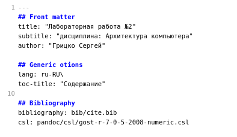
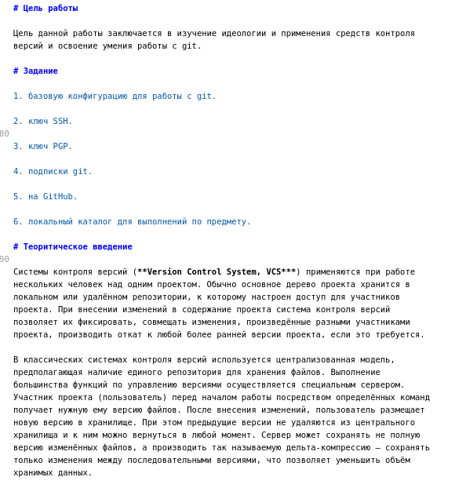
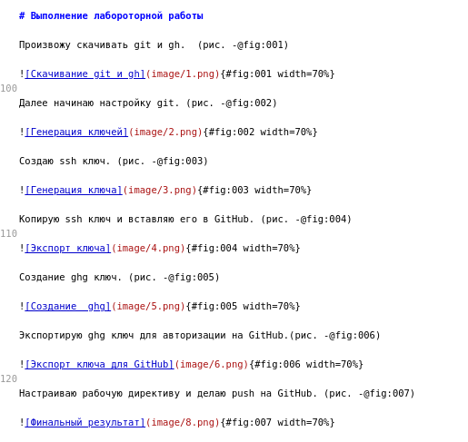
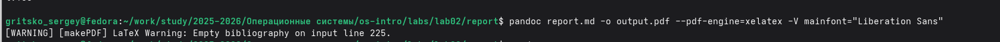

---
## Front matter
title: "Лабораторная работа №3"
subtitle: "дисциплина: Архитектура компьютера"
author: "Грицко Сергей"

## Generic otions
lang: ru-RU\
toc-title: "Содержание"

## Bibliography
bibliography: bib/cite.bib
csl: pandoc/csl/gost-r-7-0-5-2008-numeric.csl

## Pdf output format
toc: true # Table of contents
toc-depth: 2
lof: true # List of figures
lot: true # List of tables
fontsize: 12pt
linestretch: 1.5
papersize: a4
documentclass: scrreprt
## I18n polyglossia
polyglossia-lang:
  name: russian
  options:
    - spelling=modern
    - babelshorthands=true
polyglossia-otherlangs:
  name: english
## I18n babel
babel-lang: russian
babel-otherlangs: english
## Fonts
mainfont: IBM Plex Serif
romanfont: IBM Plex Serif
sansfont: IBM Plex Sans
monofont: IBM Plex Mono
mathfont: STIX Two Math
mainfontoptions: Ligatures=Common,Ligatures=TeX,Scale=0.94
romanfontoptions: Ligatures=Common,Ligatures=TeX,Scale=0.94
sansfontoptions: Ligatures=Common,Ligatures=TeX,Scale=MatchLowercase,Scale=0.94
monofontoptions: Scale=MatchLowercase,Scale=0.94,FakeStretch=0.9
mathfontoptions:
## Biblatex
biblatex: true
biblio-style: "gost-numeric"
biblatexoptions:
  - parentracker=true
  - backend=biber
  - hyperref=auto
  - language=auto
  - autolang=other*
  - citestyle=gost-numeric
## Pandoc-crossref LaTeX customization
figureTitle: "Рис."
tableTitle: "Таблица"
listingTitle: "Листинг"
lofTitle: "Список иллюстраций"
lotTitle: "Список таблиц"
lolTitle: "Листинги"
## Misc options
indent: true
header-includes:
  - \usepackage{indentfirst}
  - \usepackage{float} # keep figures where there are in the text
  - \floatplacement{figure}{H} # keep figures where there are in the text
---

# Цель работы

Научится оформлять отчеты с помощью легковесного языка разметки **Markdown**.

# Задание

* Сделать отчет в предыдущей лабороторной работе в формате Markdown.

* В качестве отчета предоставить отчет в 3 форматах: pdf, docx и md (отчет предоставить в репозитории github).

# Теоритическое введение

Для структурирования документации в формате Markdown применяется специализированная система тегов. В частности, создание заголовков осуществляется путем постановки символа решетки (#) перед текстом. Визуальное выделение элементов контента реализуется через использование звездочек: одиночные символы отвечают за курсивное начертание, двойные — за полужирное, а тройные позволяют комбинировать эти стили. Для работы с внешними источниками и цитированием используются блоки, обозначаемые знаком «больше» (>). Списки в Markdown могут быть как маркированными (через тире или астериски), так и нумерованными. При необходимости создания иерархической структуры элементов применяется система отступов для формирования вложенных подпунктов. Гиперссылки интегрируются в текст с помощью комбинации квадратных скобок для описания и круглых — для указания пути к файлу или URL-адреса.

Помимо текстовой разметки, язык поддерживает вставку программного кода: как короткими фрагментами внутри предложений, так и полноценными обособленными блоками с сохранением исходного форматирования. Математический аппарат описывается с применением синтаксиса, идентичного стандартам системы LaTeX.

Основным инструментарием для рендеринга и преобразования Markdown-документов в итоговые форматы является универсальный конвертер Pandoc. Для обеспечения корректной работы с библиографией и перекрестными ссылками необходимо наличие дополнительных расширений, таких как pandoc-citeproc и pandoc-crossref. Непосредственная конвертация исходного файла (например, README.md) в целевые форматы PDF или DOCX выполняется через командную строку с использованием флага «-o». Для оптимизации процесса обработки большого количества файлов целесообразно использовать Makefile, в котором прописываются правила автоматизации сборки через функции поиска (wildcard) и замены расширений (patsubst), что позволяет преобразовывать все документы в директории одной командой.

# Выполнение лабораторной работы

Для начала я открываю папку report с помощью **Marktext**. (рис. -@fig:001)

{#fig:001 width=70%}

Указываю основную информацию о лабораторной работе. (рис. -@fig:002)

{#fig:002 width=70%}

Формирую цель работы, задание и заполняют териотическое введение. (рис. -@fig:003)

{#fig:003 width=70%}

Описываю процесс выполнение лабороторной работы прикрепляя фотографии. (рис. -@fig:004)

{#fig:004 width=70%}

В конце конвертируем файл md в pdf. (рис. -@fig:005)

{#fig:005 width=70%}

# Выводы

В ходе выполнения данной лабораторной работы я научился оформлять отчеты с помощью Markdown.

# Список литературы(.unnumbered)
