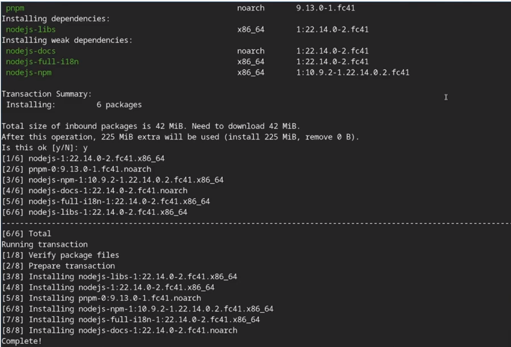
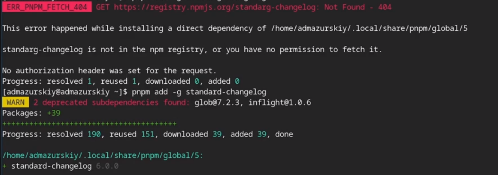
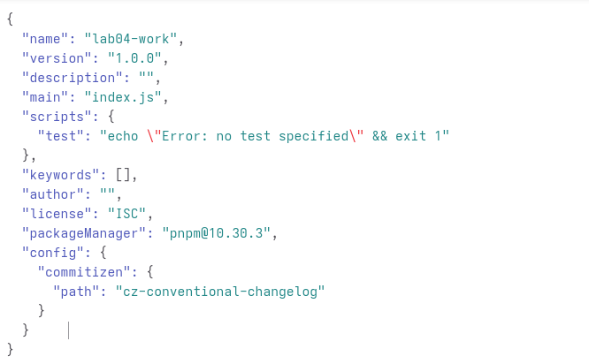
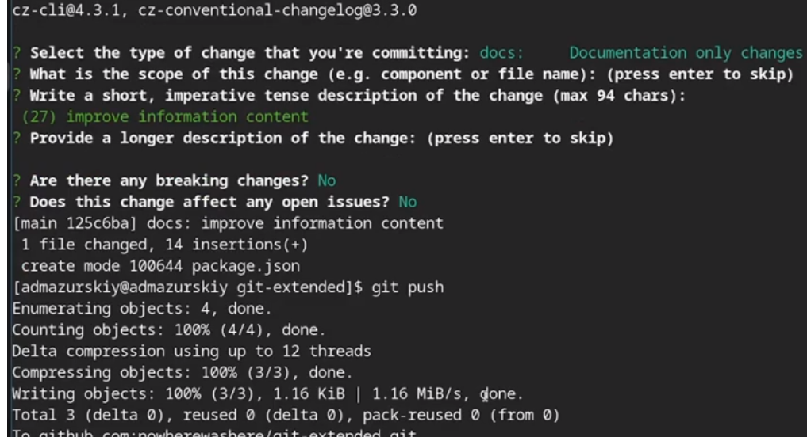
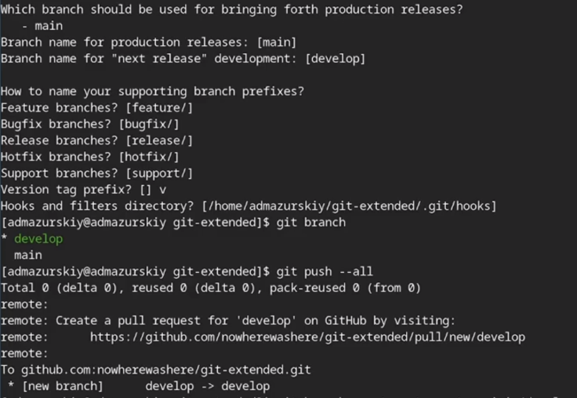
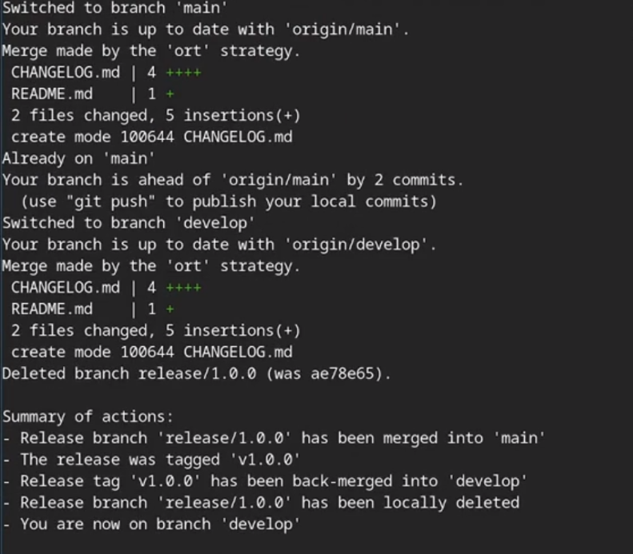
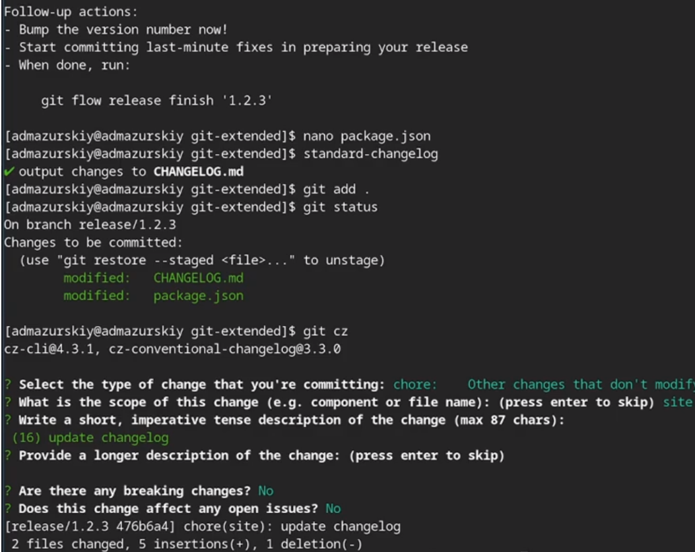

---
## Front matter
title: "Лабораторная работа №4"
subtitle: "дисциплина: Архитектура компьютера"
author: "Грицко Сергей"

## Generic otions
lang: ru-RU\
toc-title: "Содержание"

## Bibliography
bibliography: bib/cite.bib
csl: pandoc/csl/gost-r-7-0-5-2008-numeric.csl

## Pdf output format
toc: true # Table of contents
toc-depth: 2
lof: true # List of figures
lot: true # List of tables
fontsize: 12pt
linestretch: 1.5
papersize: a4
documentclass: scrreprt
## I18n polyglossia
polyglossia-lang:
  name: russian
  options:
    - spelling=modern
    - babelshorthands=true
polyglossia-otherlangs:
  name: english
## I18n babel
babel-lang: russian
babel-otherlangs: english
## Fonts
mainfont: IBM Plex Serif
romanfont: IBM Plex Serif
sansfont: IBM Plex Sans
monofont: IBM Plex Mono
mathfont: STIX Two Math
mainfontoptions: Ligatures=Common,Ligatures=TeX,Scale=0.94
romanfontoptions: Ligatures=Common,Ligatures=TeX,Scale=0.94
sansfontoptions: Ligatures=Common,Ligatures=TeX,Scale=MatchLowercase,Scale=0.94
monofontoptions: Scale=MatchLowercase,Scale=0.94,FakeStretch=0.9
mathfontoptions:
## Biblatex
biblatex: true
biblio-style: "gost-numeric"
biblatexoptions:
  - parentracker=true
  - backend=biber
  - hyperref=auto
  - language=auto
  - autolang=other*
  - citestyle=gost-numeric
## Pandoc-crossref LaTeX customization
figureTitle: "Рис."
tableTitle: "Таблица"
listingTitle: "Листинг"
lofTitle: "Список иллюстраций"
lotTitle: "Список таблиц"
lolTitle: "Листинги"
## Misc options
indent: true
header-includes:
  - \usepackage{indentfirst}
  - \usepackage{float} # keep figures where there are in the text
  - \floatplacement{figure}{H} # keep figures where there are in the text
---

# Цель работы

Получение продвинутых навыко с работ репозиториев git и релизами.

# Задание

* Выполнить работу для тестого репозитория.
* Преобразовать рабочий репозиторий в репозицию с git-flow and conventionaol commit.

# Теоретическая часть

Методология **Gitflow**, популяризированная Винсентом Дриссеном, базируется на строгом разделении веток в зависимости от этапа подготовки релиза. Этот подход оптимален для проектов с четким графиком выпусков, так как позволяет изолировать разработку новых функций от оперативных исправлений (hotfixes), которые делаются в отдельных ветках. Для контроля версий в рамках этой модели используется **SemVer (семантическое версионирование)**, где номер версии выглядит как триада: Мажорная.Минорная.Патч. Мажорная цифра меняется при серьезных изменениях, нарушающих совместимость, минорная — при добавлении нового функционала, а патч — при мелких багфиксах. Чтобы упростить управление версиями, применяется стандарт **Conventional Commits**, который задает четкие правила оформления сообщений коммитов; это позволяет на основе истории правок автоматически определять, какой компонент версии в SemVer необходимо обновить.

# Выполнение лабороторной работы

Установление nodejs, пакетный менеджер для него pnpm and gitflow. (рис. -@fig:001)

{#fig:001 width=70%}

Устанавливаю через pnpm commitezen and standard-chagelog. (рис. -@fig:002)

{#fig:002 width=70%}

Инициализирую и конфигурирую общепринятые коммиты в созданной директории через редактирование файла джсон. (рис. -@fig:003)

{#fig:003 width=70%}

Далее снимок изменений, создаю коммит и отправляю на удаленный репозиторий. (рис. -@fig:004)

{#fig:004 width=70%}

Инициализирую в репозиторриии гит флов и создаю релиз один в только что созданный репозиторий. (рис. -@fig:005)

{#fig:005 width=70%}

Создаю список изменений через стандарт чангелог, заканчиваю релиз и выгружаю на удаленные репозиторий изменения. (рис. -@fig:006)

{#fig:006 width=60%}

Иннициализирую ветку феатур для работы над новой функциональностью, готовлю и загружаю на гитхаб. (рис. -@fig:007)

{#fig:007 width=60%}

# Выводы

В ходе выполнение лабораторной работы я получил навыки правильной работы с репозиториями гит.

# Список литературы(.unnumbered)
