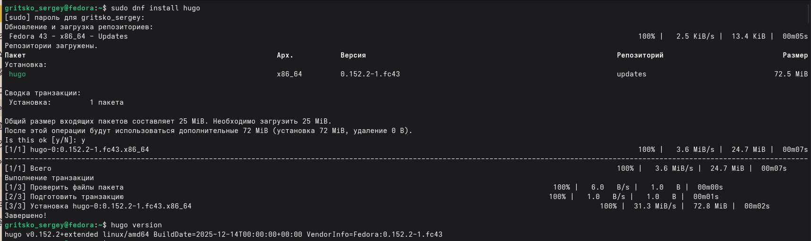
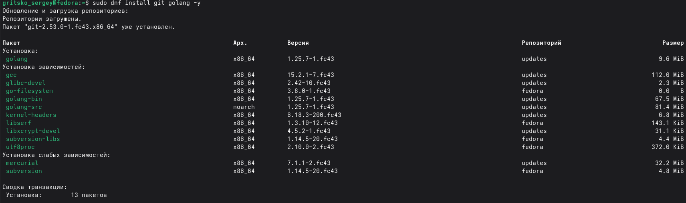
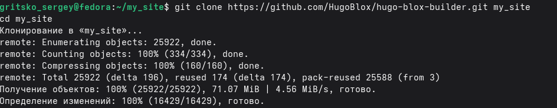
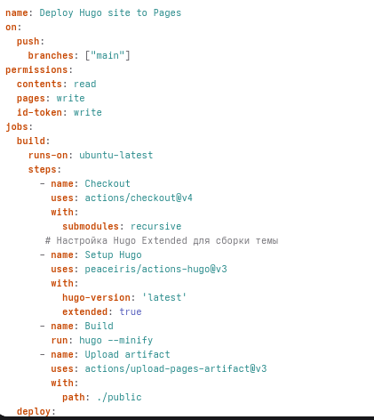
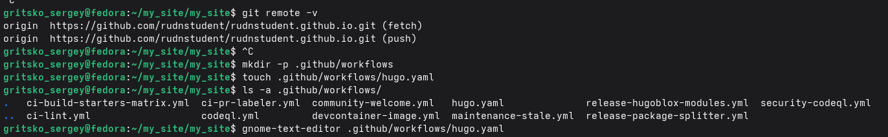
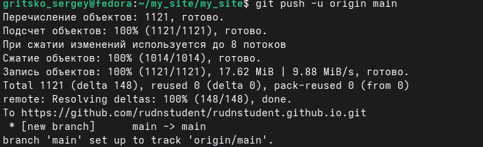
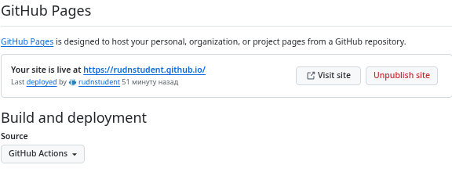
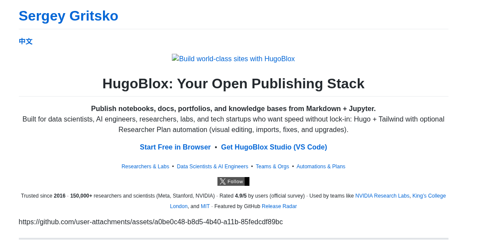

---
## Front matter
title: "Индивидуальнный проект этап №1"
subtitle: "дисциплина: Архитектура компьютера"
author: "Грицко Сергей"

## Generic otions
lang: ru-RU\
toc-title: "Содержание"

## Bibliography
bibliography: bib/cite.bib
csl: pandoc/csl/gost-r-7-0-5-2008-numeric.csl

## Pdf output format
toc: true # Table of contents
toc-depth: 2
lof: true # List of figures
lot: true # List of tables
fontsize: 12pt
linestretch: 1.5
papersize: a4
documentclass: scrreprt
## I18n polyglossia
polyglossia-lang:
  name: russian
  options:
    - spelling=modern
    - babelshorthands=true
polyglossia-otherlangs:
  name: english
## I18n babel
babel-lang: russian
babel-otherlangs: english
## Fonts
mainfont: IBM Plex Serif
romanfont: IBM Plex Serif
sansfont: IBM Plex Sans
monofont: IBM Plex Mono
mathfont: STIX Two Math
mainfontoptions: Ligatures=Common,Ligatures=TeX,Scale=0.94
romanfontoptions: Ligatures=Common,Ligatures=TeX,Scale=0.94
sansfontoptions: Ligatures=Common,Ligatures=TeX,Scale=MatchLowercase,Scale=0.94
monofontoptions: Scale=MatchLowercase,Scale=0.94,FakeStretch=0.9
mathfontoptions:
## Biblatex
biblatex: true
biblio-style: "gost-numeric"
biblatexoptions:
  - parentracker=true
  - backend=biber
  - hyperref=auto
  - language=auto
  - autolang=other*
  - citestyle=gost-numeric
## Pandoc-crossref LaTeX customization
figureTitle: "Рис."
tableTitle: "Таблица"
listingTitle: "Листинг"
lofTitle: "Список иллюстраций"
lotTitle: "Список таблиц"
lolTitle: "Листинги"
## Misc options
indent: true
header-includes:
  - \usepackage{indentfirst}
  - \usepackage{float} # keep figures where there are in the text
  - \floatplacement{figure}{H} # keep figures where there are in the text
---

# Цель

Изучить процесс создание статический сайтов с использованием генератора Hugo, освоение инструментов контроля версией git и настройка автоматизированного процесса публикации.

# Задачи

1. Подготовка рабочего окружение (установка Hugo, Go)

2. Развернуть локальную копию сайта на базе Hugo

3. Настроить конфигурацию сайта.

4. Создать удаленный репозиторий и связать его с локальным проектом.

5. Настроить сборку и публикацию сайта чере гит.

# Теоретическое введение

Hugo — это один из самых быстрых генераторов статических сайтов (SSG), написанный на языке Go. В отличие от CMS (например, WordPress), Hugo собирает сайт в готовые HTML-файлы на стороне разработчика или сервера сборки, что обеспечивает высокую скорость загрузки и безопасность.

Hugo Blox (ранее Wowchemy) — фреймворк для Hugo, позволяющий создавать сайты-портфолио и академические ресурсы с помощью виджетов и конфигурационных файлов без глубокого знания HTML/CSS.

GitHub Pages & Actions — экосистема для хостинга и автоматизации. GitHub Actions позволяет реализовать конвейер: при каждом обновлении кода сервер GitHub сам устанавливает Hugo, собирает проект и копирует результат на хостинг Pages.

# Выполнение лабораторной работы

Устанавливаю hugo и go. (рис. -fig:001)

{#fig:001 width=70%}

{#fig:002 width=70%}

Далее я выполняю клонирование репозитория hugo-blox-builder. (рис. -fig:003)

{#fig:003 width=70%}

В корневой папке проекта редактирую файл конфигурациии. (рис. -fig:004)

{#fig:004 width=70%}

Для автоматизации деплоя была создана скорытая дериктория. (рис. -fig:005)

{#fig:005 width=70%}

В итоги пушаю все наработки на github. (рис. -fig:006)

{#fig:006 width=70%}

В настройке репозитория указываю github actions. (рис. -fig:007)

{#fig:007 width=70%}

Как выглядить мой сайт. (рис. -fig:008)

{#fig:008 width=70%}

# Выводы

 МЫ научили размещать сайт на github pages, выполнили первый этап индивидуального проекта

# Cписок литературы{.unnumbered}

 :::{#refs}:::
